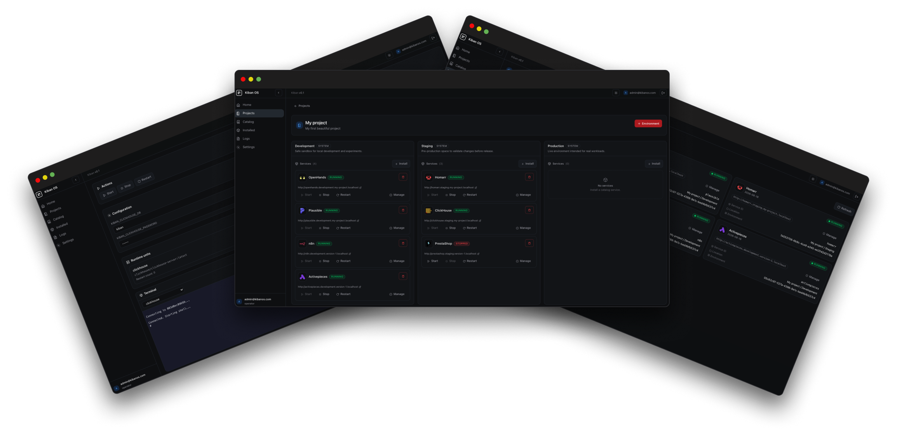

# Kiban OS

> [!NOTE]
> Kiban OS is still in beta. We are actively developing the platform and welcome contributions.



KibanOS is an open-source infrastructure platform. Developers build software; Kiban builds infrastructure.

The user never has to think about containers, images, networks or volumes. They interact with projects, environments, services and stacks. Everything else is an implementation detail.

## What Kiban is not

- A Docker UI
- A Docker Compose editor
- A PaaS
- A Kubernetes dashboard

Docker is only the runtime. Kiban abstracts it away completely.

## Features

- **Service catalog** with 100+ services across 30 categories (databases, AI, monitoring, CMS, productivity, messaging, and more)
- **Project and environment management** with isolated networks per environment
- **Automatic reverse proxy** via Traefik with local URLs (`{service}.{project}.localhost`)
- **Interactive terminal** for debugging installed service containers
- **Service logs** with auto-refresh, copy and clear
- **Health monitoring** with Docker Health as the authoritative signal
- **Automatic port assignment** to avoid collisions
- **Zero-code extensibility** -- adding a new service only requires a catalog folder, no TypeScript changes
- **Clean Architecture** backend (NestJS + Fastify) and Angular frontend with TailwindCSS
- **SQLite** with Drizzle ORM
- **Dark theme** and responsive layout

## How it works

```
Projects
  └── Environments (Development, Staging, Production)
        └── Installed Services (PostgreSQL, Redis, Grafana, etc.)
```

Each project groups related infrastructure. Each environment is fully isolated. Services are installed from a read-only catalog and managed through a single web UI.

Kiban owns HTTP routing. The user never configures Traefik labels or Docker networks manually. Everything is generated from the service catalog and the project configuration.

## Quick start

Requirements: Docker and Docker Compose.

```bash
curl -fsSL https://get.kibanos.com | sh
```

Then open the web UI and create your first project.

## Development

### Requirements

- Node.js 22+
- pnpm 9.15+
- Docker and Docker Compose

### Clone and install

```bash
git clone https://github.com/kiryokulabs/kiban.git
cd kiban
pnpm install
```

### Run in development

```bash
pnpm dev
```

This starts both the API and the web UI:

- API: http://localhost:3100
- Web UI: http://localhost:4200

### Run individually

```bash
# API only
cd apps/api
pnpm dev

# Web only
cd apps/web
pnpm dev
```

### Other commands

```bash
pnpm build         # Build all packages and apps
pnpm test          # Run all tests
pnpm lint          # Type-check all packages
pnpm format        # Format with Prettier
```

## Tech stack

| Layer | Technology |
|-------|-----------|
| Backend | NestJS + Fastify |
| Frontend | Angular + TailwindCSS |
| Database | SQLite + Drizzle ORM |
| Runtime | Docker Compose |
| Reverse proxy | Traefik |
| Language | TypeScript (strict mode) |

## Architecture

The project follows Clean Architecture with strict dependency inversion:

```
UI (Angular)
    │
    ▼
Application Layer (NestJS)
    │
    ▼
Domain / Business Logic
    │
    ▼
Infrastructure Layer (Docker Compose, SQLite, etc.)
```

Dependencies always point inward. Business logic never depends on infrastructure. Docker, SQLite, NestJS and Angular are implementation details at the edges.

Full architecture documentation: [docs/architecture.md](./docs/architecture.md)

## Local configuration

Runtime data lives under `~/.kiban/`:

```
~/.kiban/
  config/
  database/
  plugins/
  logs/
  cache/
```

The repository includes `.kiban-template/` to document that layout without writing outside the project during development.

## Documentation

- [Architecture](./docs/architecture.md)
- [Authentication](./docs/authentication.md)
- [Projects & Environments](./docs/projects.md)
- [Testing](./docs/testing.md)
- [Terminal](./docs/terminal.md)
- [Roadmap](./docs/roadmap.md)

## Contributing

Contributions are welcome. Please read the development guidelines in [AGENTS.md](./AGENTS.md) and the [Code of Conduct](./CODE_OF_CONDUCT.md) before submitting a pull request.

All contributions must follow:

- Test-driven development (tests first, then implementation)
- Clean Architecture (dependencies point inward)
- SOLID principles
- TypeScript strict mode
- No business logic in controllers or UI components

## License

Apache-2.0
